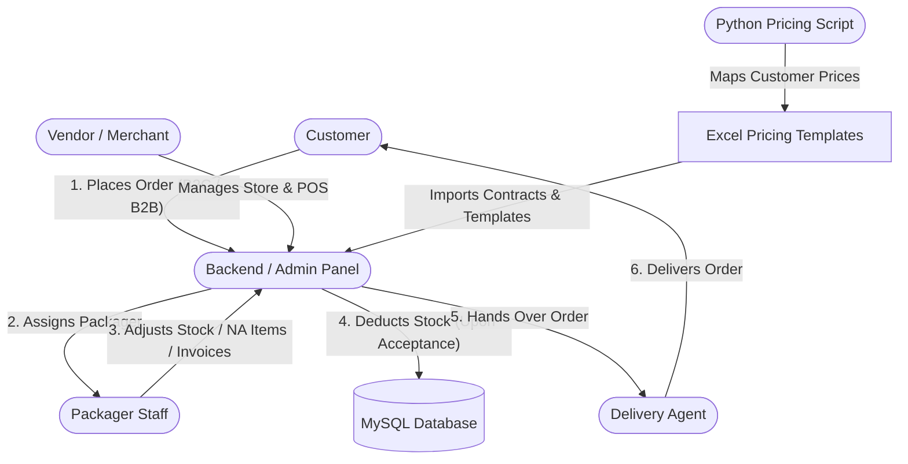

# 🍏 NutriBasket Monorepo

[](https://laravel.com)
[](https://flutter.dev)
[](https://python.org)
[](https://mysql.com)
[](https://firebase.google.com)

Welcome to the **NutriBasket** repository—a state-of-the-art B2B and B2C grocery & food delivery ecosystem. Built on a robust Laravel admin backend and powered by four specialized Flutter mobile applications, NutriBasket handles the complete delivery lifecycle: customer ordering, merchant management, order packaging/fulfillment, contract-based B2B pricing, and last-mile delivery.

---

## 🏗️ System Architecture & Data Flow

Below is the interaction mapping between the customer, vendor, packager, delivery agent, the admin backend, and the local B2B pricing script:



---

## 🗂️ Repository Structure

This monorepo consolidates all components of the NutriBasket ecosystem:

```bash
NutriBasket(GitHub)
├── 🖥️ NutriBasket-AdminPanel/ # Laravel backend API, admin panels, and database migrations
├── 📱 NutriBasket-UserApp/          # Flutter customer app for shopping and tracking
├── 🏬 NutriBasket-Vendor/           # Flutter vendor app for merchants and store management
├── 📦 NutriBasket-Packaging/        # Flutter app for packaging staff (B2B invoices, item availability)
├── 🛵 NutriBasket-Delivery/         # Flutter app for delivery agents (route tracking, updates)
├── 📊 Excel Script/                 # Python script & template files for mapping B2B contract pricing
├── 📑 New Contracts/                # Spreadsheet contracts (.xlsx) for B2B partners
└── 💾 App Releases/                 # Compiled ready-to-install Android APK files (v1.0 & v2.0)
```

---

## 🌟 Key Custom Features & Enhancements

NutriBasket extends standard multi-vendor platforms with several high-performance enterprise features:

### 1. 📦 Dedicated Packager Role & Order Fulfillment Pipeline
Unlike standard delivery platforms, NutriBasket introduces a **Packager** step in the chain. Orders are dispatched to a packager based on the `packager_id` field in the database.
* **Order Modifications**: Packagers can adjust quantities or mark items as **"NA" (Not Available)** if they are out of stock.
* **Smart UI Warnings**: The User App dynamically displays alerts to customers if their order has been modified, identifying which items were changed and why.

### 2. 🧾 B2B Contract-Based Pricing & Invoice System
NutriBasket serves enterprise (B2B) clients (such as *Ozora, CAARA, Box8, Yellow Straw*, and *RDB outlets*).

* **Local Sheet Automation**: A python script merges B2B client contracts with item price sheets.
* **Database Template Mapping**: Admin uploads these customized pricing templates to match contract prices when B2B orders are placed.
* **PDF Invoice Drawer**: The Packaging App lets staff generate, view, and download professional B2B invoices as PDFs locally.

### 3. ⏱️ Delayed Stock Deduction Flow
* **The Problem**: Pre-deducting stock immediately upon order placement locked up items for orders that might be rejected or cancelled.
* **The Solution**: Stock deduction is delayed. Product stock remains intact through the "preparing" and "processing" stages and is **only deducted** once the order moves to `accepted` status.

### 4. 📊 Intelligent Inventory Deficit Monitoring
An advanced Inventory Management System is built into the Laravel admin backend.
* **Live Calculation**: Displays *Current Stock* vs. *Total Ordered* to calculate the *Extra Needed* deficit in real-time.
* **Bulk Purchases**: Admin can bulk-update inventory. When stock is increased, a purchase record is automatically saved with the vendor's name, unit price, and note tracking.

---

## 📱 Detailed Sub-Application Deep-Dive

NutriBasket consists of 4 Flutter mobile applications, 1 Laravel backend service, and 1 automated pricing script. Each has a specific role, distinct modules, and key configurations:

### 1. 🛒 Customer / User App (`NutriBasket-UserApp`)
* **Role**: Primary storefront for B2C retail customers and B2B ordering points.
* **Technology**: Flutter (Dart), GetX State Management, Flutter SDK `3.27.4`.
* **Key Feature Modules**:
  * [lib/features/store](file:///e:/2centscapital/NutriBasket%28GitHub%29/NutriBasket-UserApp/lib/features/store) & [lib/features/item](file:///e:/2centscapital/NutriBasket%28GitHub%29/NutriBasket-UserApp/lib/features/item): Dynamic category, subcategory, and brand search. Supports custom filters tailored to restaurant, pharmacy, grocery, and parcel modules.
  * [lib/features/cart](file:///e:/2centscapital/NutriBasket%28GitHub%29/NutriBasket-UserApp/lib/features/cart) & [lib/features/checkout](file:///e:/2centscapital/NutriBasket%28GitHub%29/NutriBasket-UserApp/lib/features/checkout): In-app cart management, multi-gateway integration (Stripe, Razorpay, Paytm, etc.), wallet balances, and loyalty points conversion.
  * [lib/features/order](file:///e:/2centscapital/NutriBasket%28GitHub%29/NutriBasket-UserApp/lib/features/order): Live order tracking and history. Integrates real-time alerts if the packager updates the items or marks them **"NA" (Not Available)**, displaying the modification reason and adjusted subtotal immediately.
  * [lib/features/location](file:///e:/2centscapital/NutriBasket%28GitHub%29/NutriBasket-UserApp/lib/features/location): Geo-coordinate pinpointing using `geolocator` and `google_maps_flutter` for accurate home delivery.

### 2. 🏪 Vendor / Merchant App (`NutriBasket-Vendor`)
* **Role**: Store dashboard for merchants to manage food & grocery listings, inventory status, and offline store activities.
* **Technology**: Flutter (Dart), GetX State Management, ESC/POS Bluetooth integration.
* **Key Feature Modules**:
  * [lib/features/pos](file:///e:/2centscapital/NutriBasket%28GitHub%29/NutriBasket-Vendor/lib/features/pos) (Point of Sale): Quick order builder interface for in-store walk-in customers, connecting directly to inventory stock.
  * [lib/features/order](file:///e:/2centscapital/NutriBasket%28GitHub%29/NutriBasket-Vendor/lib/features/order) & [lib/features/deliveryman](file:///e:/2centscapital/NutriBasket%28GitHub%29/NutriBasket-Vendor/lib/features/deliveryman): Manage order acceptances, dispatch notifications, and assign store-managed delivery agents.
  * **Thermal Bluetooth Printing**: Prints order receipts instantly in-shop using `print_bluetooth_thermal` and `flutter_esc_pos_utils`.
  * [lib/features/addon](file:///e:/2centscapital/NutriBasket%28GitHub%29/NutriBasket-Vendor/lib/features/addon) & [lib/features/campaign](file:///e:/2centscapital/NutriBasket%28GitHub%29/NutriBasket-Vendor/lib/features/campaign): Setup add-on items, configure product discounts, and participate in global store campaigns.

### 3. 📦 Packaging Staff App (`NutriBasket-Packaging`)
* **Role**: Operational companion for packaging personnel at hubs to fulfill orders and prepare them before pickup.
* **Technology**: Flutter (Dart), GetX, PDF generation & storage integrations.
* **Key Feature Modules**:
  * [lib/features/order](file:///e:/2centscapital/NutriBasket%28GitHub%29/NutriBasket-Packaging/lib/features/order) (Availability Updates): Packagers can check off items on the packaging queue, edit order quantities, or mark items as "NA" if unavailable.
  * **B2B PDF Invoice Generator**: Dedicated billing widget that queries `/api/v1/orders/{orderId}/invoice` to generate, view, and download PDF invoices named `Order_[ID]_Invoice.pdf` to local storage (`path_provider`).
  * [lib/features/auth](file:///e:/2centscapital/NutriBasket%28GitHub%29/NutriBasket-Packaging/lib/features/auth): Custom login and profile matching via Packager APIs.
  * [lib/features/dashboard](file:///e:/2centscapital/NutriBasket%28GitHub%29/NutriBasket-Packaging/lib/features/dashboard): Displays queues categorized by *Assigned*, *In Packaging*, and *Picked Up* status.

### 4. 🛵 Delivery Rider App (`NutriBasket-Delivery`)
* **Role**: Companion application for delivery personnel to receive, navigate, and update orders on-the-go.
* **Technology**: Flutter (Dart), GetX, Google Maps API.
* **Key Feature Modules**:
  * [lib/features/order](file:///e:/2centscapital/NutriBasket%28GitHub%29/NutriBasket-Delivery/lib/features/order) (Acceptance & Handover): Real-time push notification system (`firebase_messaging`) for new order requests, showing routes and address nodes.
  * [lib/features/chat](file:///e:/2centscapital/NutriBasket%28GitHub%29/NutriBasket-Delivery/lib/features/chat): In-app chat connecting delivery riders directly with both the store and the customer.
  * [lib/features/cash_in_hand](file:///e:/2centscapital/NutriBasket%28GitHub%29/NutriBasket-Delivery/lib/features/cash_in_hand) & [lib/features/disbursement](file:///e:/2centscapital/NutriBasket%28GitHub%29/NutriBasket-Delivery/lib/features/disbursement): Log delivery agent cash-on-delivery collections, overall driver wallet earnings, and request payouts.

### 🖥️ Admin & Backend Service (`NutriBasket-AdminBackend`)
* **Role**: The centralized server engine, administrative control panel, and database API.
* **Technology**: Laravel 10/11, PHP 8.x, MySQL, Firebase Messaging.
* **Key Core Modules**:
  * [app/Http/Controllers/Admin/B2BClientController.php](file:///e:/2centscapital/NutriBasket%28GitHub%29/NutriBasket-AdminBackend-dev/app/Http/Controllers/Admin/B2BClientController.php): Manages B2B enterprise client templates, addresses, and maps default packager and delivery ids.
  * [app/Http/Controllers/Admin/InventoryController.php](file:///e:/2centscapital/NutriBasket%28GitHub%29/NutriBasket-AdminBackend-dev/app/Http/Controllers/Admin/InventoryController.php): Displays real-time deficit dashboards (Current Stock vs Total Ordered = Extra Needed) with bulk updates and automatic vendor tracking.
  * [app/Http/Controllers/Api/V1/PackagerController.php](file:///e:/2centscapital/NutriBasket%28GitHub%29/NutriBasket-AdminBackend-dev/app/Http/Controllers/Api/V1/PackagerController.php): Dedicated endpoints for Packager logins, order list fetching, item NA marking, and status updates.

### 📊 Python Pricing Script (`Excel Script`)
* **Role**: Offline B2B contract generator.
* **Technology**: Python 3.x, `pandas`, `openpyxl`.
* **Flow**: Parses `Customer_List_Updated.xlsb.xlsx` (pricing matrices) and cross-references `contract_items_template.xlsx` using lowercase matching algorithms to generate customer-specific pricing spreadsheets (e.g. `contract_items_with_conversationroom_prices.xlsx`), which are then uploaded to the Laravel database templates.

---

## 💾 App Releases

Compiled APKs for testing are available directly in the [App Releases/](file:///e:/2centscapital/NutriBasket%28GitHub%29/App%20Releases) directory:
* **v1.0 Releases**: Includes User App, Packaging App, and Delivery App.
* **v2.0 Releases**: Updated version of the User App (`nb-user-updated.apk`).

---

## 🚀 Getting Started

### 1. Backend Setup
1. Navigate to [NutriBasket-AdminBackend-dev](file:///e:/2centscapital/NutriBasket%28GitHub%29/NutriBasket-AdminBackend-dev)
2. Install PHP dependencies:
   ```bash
   composer install
   ```
3. Set up your `.env` configuration file:
   ```bash
   cp .env.example .env
   ```
4. Run migrations and register database schemas:
   ```bash
   php artisan migrate
   ```
5. Serve the server locally:
   ```bash
   php artisan serve
   ```

### 2. Flutter Apps Setup
1. Navigate to any of the app folders (e.g., [NutriBasket-UserApp](file:///e:/2centscapital/NutriBasket%28GitHub%29/NutriBasket-UserApp)).
2. Ensure you have Flutter SDK `3.27.4` installed.
3. Fetch dependencies:
   ```bash
   flutter pub get
   ```
4. Run the application:
   ```bash
   flutter run
   ```

### 3. Excel Python Script Setup
1. Navigate to [Excel Script](file:///e:/2centscapital/NutriBasket%28GitHub%29/Excel%20Script).
2. Install dependencies:
   ```bash
   pip install pandas openpyxl
   ```
3. Run the mapping automation:
   ```bash
   python script.py
   ```
